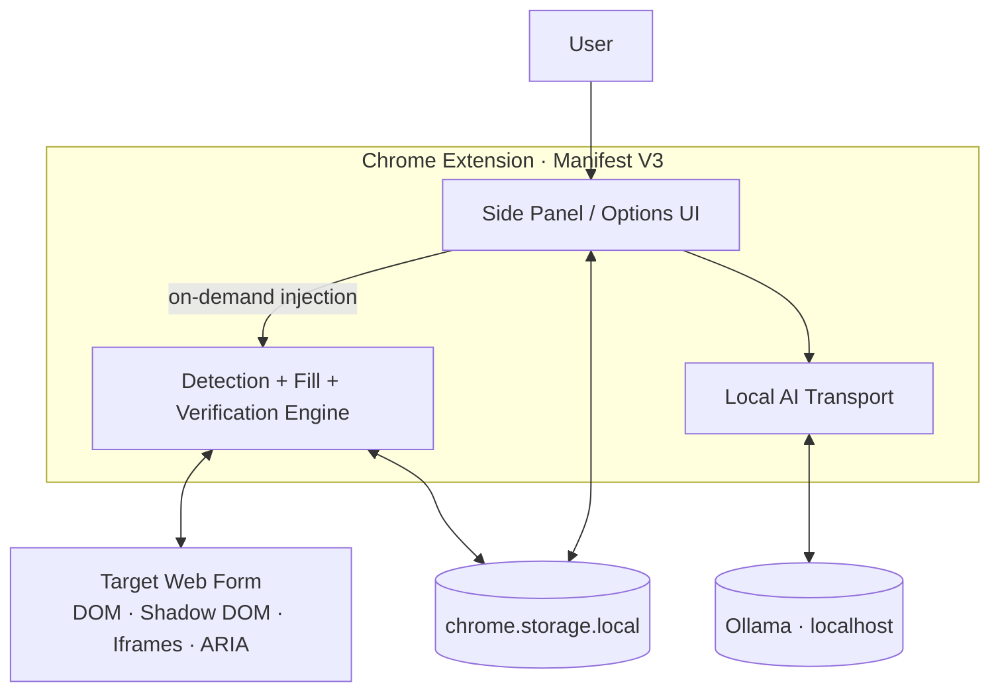
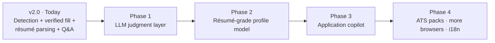

<div align="center">

# Fillo AI Pro

### A privacy-first, local-AI copilot for job applications and complex web forms

**Save your profile once. Open almost any form. Detect → fill → verify → review.**

[](#)
[](https://ollama.com/)
[](#)
[](#privacy--security)
[](#design-principles)

[**Live Website**](https://fillo-ai-landing-page.pages.dev/) ·
[**Chrome Web Store**](https://chromewebstore.google.com/detail/fnnlcgkmlimkadibaefjkfmpigollchk) ·
[**Watch Demo**](https://www.youtube.com/watch?v=3XkGIlCGFtY) 
<!-- [**Roadmap**](ROADMAP.md) -->

</div>

---

> **In one line:** a Manifest V3 Chrome extension that pairs a deterministic form-understanding engine with a **local** LLM judgment layer — it reads field intent across difficult DOM structures, fills framework-controlled inputs safely, verifies its own selections, attaches documents, and uses AI only for the questions that actually need it. Nothing leaves your machine, and nothing is ever submitted without you.

## Why it exists

Job applications ask candidates to re-type information that already lives in their résumé — contact details, work history, education, links, eligibility, salary, and long-form questions. Basic autofill handles predictable fields. Modern ATS platforms don't: they use custom widgets, dynamic sections, framework-controlled inputs, ARIA components, iframes, and inconsistent labels.

**Fillo AI Pro treats form filling as a systems problem, not a text-pasting problem.**

The deterministic engine does the high-confidence work first — instantly and for free. A local model is used only where judgment is genuinely useful. You stay responsible for review and submission.

---

## Demo

[](https://www.youtube.com/watch?v=3XkGIlCGFtY)

<table>
<tr>
<td width="50%" align="center"><strong>Main Experience</strong></td>
<td width="50%" align="center"><strong>Custom Fill</strong></td>
</tr>
<tr>
<td></td>
<td></td>
</tr>
<tr>
<td width="50%" align="center"><strong>Settings</strong></td>
<td width="50%" align="center"><strong>Profile Editor</strong></td>
</tr>
<tr>
<td></td>
<td></td>
</tr>
</table>

---

## What it does

| Capability | Status |
|---|:--:|
| Field-intent detection across poorly labeled forms | ✅ |
| React / Vue / Angular controlled inputs | ✅ |
| Custom JS dropdowns (Workday, Greenhouse, React-Select, MUI, …) | ✅ |
| Google Forms & ARIA widgets (`role=radio/checkbox/listbox`) | ✅ |
| Open Shadow DOM + iframes | ✅ |
| Résumé / cover-letter upload into file fields | ✅ |
| Résumé → profile extraction (PDF) | ✅ |
| Custom Q&A with AI Enhance | ✅ |
| Answer memory + past-response learning | ✅ |
| AI answers for open-ended questions (local Ollama) | ✅ |
| Right-click single-field fill + keyboard shortcuts | ✅ |
| Auto-submit | 🚫 intentionally excluded |
| CAPTCHA bypass | 🚫 never read, never touched |

---

## Architecture

Manifest V3, vanilla JavaScript, **no build step**, **zero runtime dependencies** (the only bundled library is pdf.js, used offline for résumé parsing). The engine is injected **on demand** under `activeTab` — nothing runs on any page until you invoke it.



**The pipeline, at a glance:**

```
Discover → Understand → Classify → Resolve → Fill → Verify → Escalate → Report
```

Detection and mutation are kept separate. AI is additive, never foundational. Every write is verified. And when confidence runs out, the system reports or skips — it never fakes success.

---

## How it works (without the recipe)

**Reading a field's *intent* is the hard part** — and it's where naive fillers die. Fillo AI Pro reconstructs each field's true question through a **9-layer resolution hierarchy**, ranging from explicit accessibility metadata down to structural and positional inference of the surrounding DOM. That's why it can read a field like this — no `for`, no useful `name`, no placeholder — that most tools see as an anonymous text box:

```html
<label>Full Name</label>
<input type="text">
```

Intent alone isn't enough, so each field is also enriched with **section context** (Personal / Experience / Education / …) reconstructed from the page's structure — so an *Experience → Company* never gets confused with a *Reference → Company*, and an ambiguous "Email" lands in the right place.

**Filling is verified, not assumed.** Standard inputs are written through the element's native setter with the events modern frameworks expect, so React/Vue/Angular state actually updates. Custom dropdowns follow a **verify-then-escalate** strategy: the widget is driven, then *checked* to confirm it accepted the value — with fallbacks, and an honest empty result rather than forcing invalid text into a closed-choice control. Conditional fields revealed by earlier answers are picked up automatically.

**AI is deterministic-first and local.** Everything the engine can answer from your profile, Custom Q&A, and memory is resolved instantly and for free. Only the leftover, open-ended questions go to a model running on **your** machine via [Ollama](https://ollama.com) — grounded in your profile, instructed never to invent employers, dates, or credentials, and always drafted for you to review.

**Answer priority is intentional:**

```
Profile  →  Custom Q&A  →  Answer memory  →  Past responses  →  Local AI  →  Honest skip
```

Factual data stays deterministic; generation is reserved for the tasks where generation is actually useful.

---

## Design principles

- **Deterministic first, AI second** — lower latency, lower hallucination risk, predictable and offline-resilient.
- **Verify writes, don't trust actions** — a click or an assignment is not proof the widget accepted it.
- **Honest skip over fake completion** — for a job application, a silently wrong answer is worse than a visibly empty one.
- **Local AI boundary** — sensitive résumé and application data never require a cloud account.
- **No auto-submit** — you see and approve everything before it reaches an employer.
- **On-demand injection** — `activeTab` instead of broad, always-on host access.

---

## Tech Stack

| Layer | Technology |
|---|---|
| Browser platform | Chrome Extension, Manifest V3 |
| Language | Vanilla JavaScript (ES2020) — no framework, no build step |
| Background runtime | MV3 Service Worker |
| Page access | `chrome.scripting` + `activeTab` (on-demand injection) |
| Persistence | `chrome.storage.local` |
| Local AI | Ollama (local REST inference) |
| Résumé parsing | pdf.js |
| DOM intelligence | Accessibility metadata, structural context, Shadow DOM traversal |
| File injection | `DataTransfer` API |
| Dynamic forms | `MutationObserver` |

---

## Privacy & Security

Your data lives **only** in `chrome.storage.local` on your machine. No account, no analytics, no cloud AI keys, no broad host permissions. AI features talk exclusively to *your* Ollama at localhost — your profile, résumé text, and the form's questions go there and nowhere else.

**Permanent non-goals:** no auto-submit · no CAPTCHA bypass · no fabricated qualifications · no required cloud account · no telemetry.

---

## Installation

Install from the **[Chrome Web Store](https://chromewebstore.google.com/detail/fnnlcgkmlimkadibaefjkfmpigollchk)**, then open the profile editor and save your details — or upload your résumé and let the AI build the profile for you.

## Local AI Setup

AI features need [Ollama](https://ollama.com/) running locally. Without it, deterministic field filling still works — you just won't get AI-written answers.

```bash
ollama pull llama3.2:3b     # or gemma3:1b on lower-end hardware
```

Keep Ollama running, then open **Settings → AI**, fetch the model, and test the connection. The extension routes AI calls through its service worker, so normal local use needs no browser CORS configuration.

## Usage

- **Full form** — open the side panel and hit **Auto Fill**, then optionally **AI Fill** for open-ended leftovers. Review the highlighted changes and submit manually.
- **Keyboard** — `Alt+Shift+G` fills the whole form · `Alt+Shift+F` fills the focused field · `Alt+Shift+C` opens a custom-answer prompt.
- **Right-click** any editable field for Smart Fill, a direct AI answer, a custom instruction, or length presets.

---

## Roadmap



<!-- See **[ROADMAP.md](ROADMAP.md)** for the full product direction. -->

---

## Known limits

- Custom calendar / date-picker widgets may need a manual touch.
- Multi-entry Experience/Education repeaters aren't fully supported yet *(planned)*.
- Cross-origin iframe reporting can differ from top-frame counts.
- Remote (non-localhost) Ollama endpoints may need server-side CORS configuration.
- CAPTCHA is intentionally unsupported.

---

## Author

**Anurag Singh** — AI & Data Engineer · Python / ML / NLP / Local LLM Systems

[Website](https://fillo-ai-landing-page.pages.dev/) · [Chrome Web Store](https://chromewebstore.google.com/detail/fnnlcgkmlimkadibaefjkfmpigollchk) · [Demo](https://www.youtube.com/watch?v=3XkGIlCGFtY) · [LinkedIn](https://linkedin.com/in/anurag2050) · [GitHub](https://github.com/anuragroque)

---

<div align="center">

**Automate repetition. Verify uncertainty. Keep the human in control.**

<sub>Keywords: job application autofill · ATS automation · Chrome extension · Manifest V3 · local LLM · Ollama · résumé parser · form understanding · field-intent detection · React-safe inputs · Shadow DOM · ARIA · privacy-first AI · human-in-the-loop</sub>

</div>
